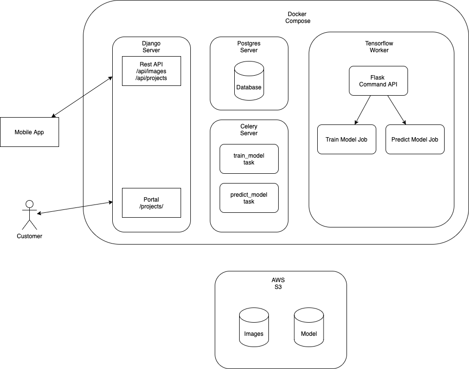

# Crowd Source Image Collector

## iOS Swift APP

The iOS swift app is located under the folder: "CrowdSourceImageCollector". The app uses the framework called Alamofire in order to upload the pictures to the server. Use cocoa pods to install the framework into the project (notice the Podfile).

## Backend

The backend is composed of many different actors: app (django web backend), celery, redis (acting as celery's broker), postgres (database for the django web backend) and the tensorflow worker (where the machine learning scripts reside and are executed).



Here's a description of each actor:

1. app (django web backend):
    - Offers the portal in which the users can create projects, test the model and train the model.
    - Provides a rest API that enables the mobile app to upload images and query information about the projects.
    - The images are saved to local disk but also uploaded to s3.
    - The portal delegates time consuming tasks such as training and testing the model to the celery container.
2. celery:
    - It's used by the web backend to conduct asynchronous tasks such as training the model and using the model to predict the label of images. 
    - When the user clicks on the button "Train Model", the web portal creates an asynchronous task of "train_model" type on celery.
    Celery then sends a command to the tensorflow worker to execute the script train_model.py with the appropriate parameters and
    awaits for the tensorflow worker to complete the execution of the script.
    - It does a similar work to trigger the script predict_model.py on the tensorflow worker which is used to test the model.
    - The communication in between the celery container and the tensorflow container is done via a rest api of the tensorflow-worker container.
3. tensorflow-worker:
    - This container exposes a rest api (https://flask-shell2http.readthedocs.io/en/latest/) that enables the celery worker to execute the tensorflow scripts: train_model.py and predict_model.py.
    - The celery worker calls this API instructing the container to run the tensorflow scripts.
    - The tensorflow scripts pull the images from s3 and do the training of the model.
    - The resulting model is uploaded to s3.
4. postgres:
    - Database utilized to persist the information about the projects, its images and the testing of its model.
    - Contains the entities: Project, Image and ModelHistory (stores the results of each test run of the model).
5. Redis:
    - Acts as a broker for celery and the web portal.
6. Mobile App:
    - The iOS Swift app that enables users to upload pictures with labels for each project.


## Docker

The backend is powered by docker images. In order to run the project locally you need to use "docker-compose":
```
cd portal/image_app/
docker-compose up
```

The "docker-compose.yml" file is used to run the project locally. The "docker-copose-server.yml" is a separate file utilized to deploy the project in a VPS such as an "aws ec2 instance". Other technologies 
can be leveraged to deploy a more scalable environment for this project.